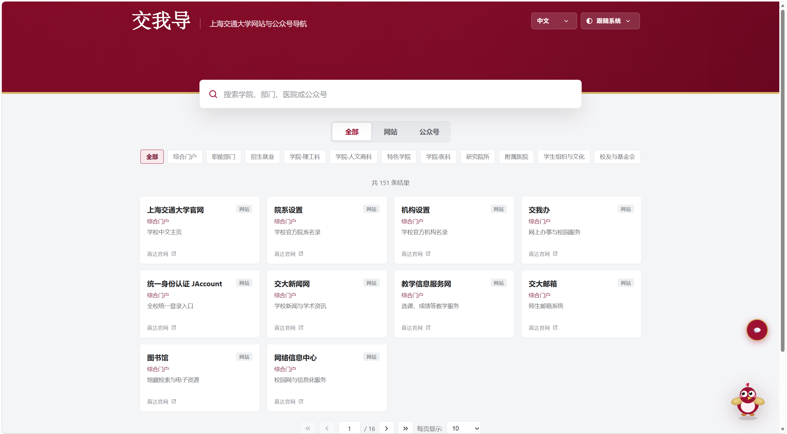
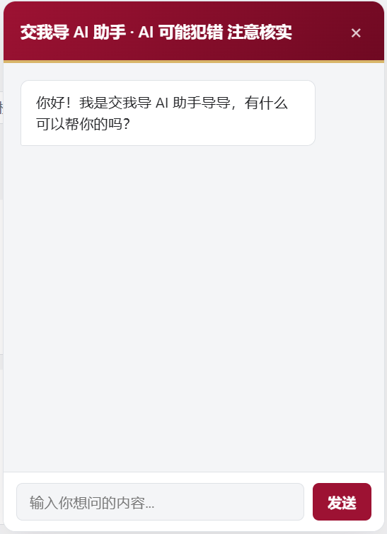
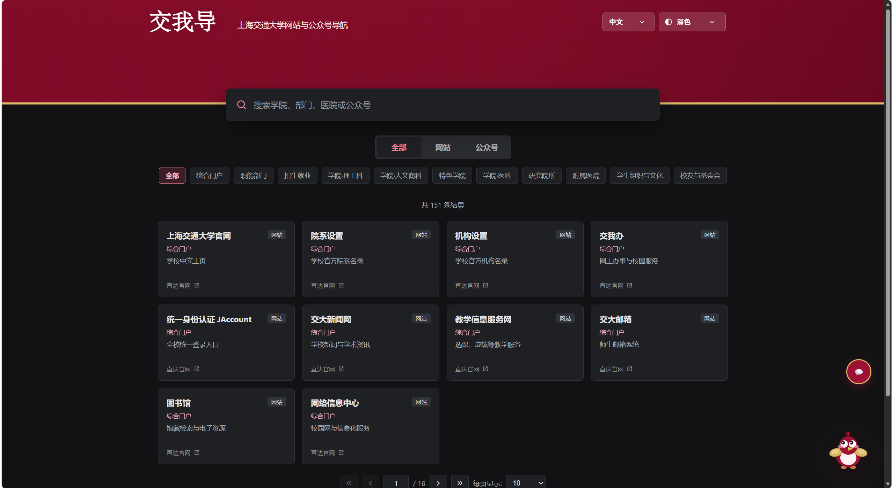
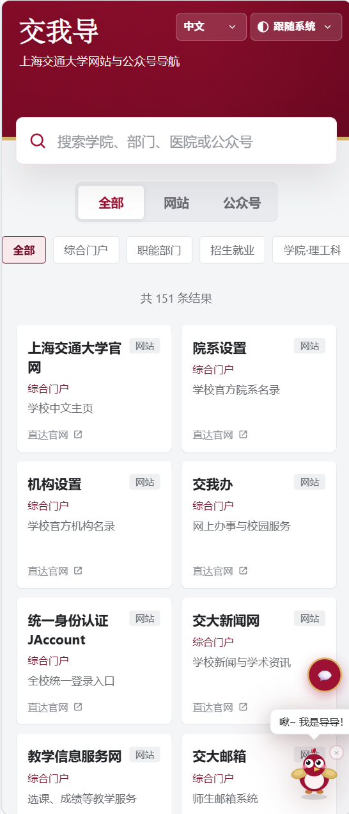

<h1 align="center">交我导（SJTU Links）</h1>

<p align="center">
  上海交通大学官方网站与微信公众号导航平台
</p>

<p align="center">
  一个简洁、美观、响应式的校园资源导航网站，帮助师生快速访问学校各类官方网站与微信公众号。
</p>

<p align="center">
  
  
  
  
  
</p>

---

## 📖 项目简介

**交我导（SJTU Navigator）** 是一个面向上海交通大学师生打造的校园资源导航网站。

项目收录了学校官方网站、学院网站、行政部门、科研机构、附属医院、公共服务平台以及微信公众号等资源，并提供搜索、分类浏览、中英文切换、深浅色模式、AI 助手等功能。

本项目采用 **原生 HTML + CSS + JavaScript** 开发，无需任何前端框架，也无需后端服务器，可直接部署至 GitHub Pages、Cloudflare Pages、Vercel 等静态网站托管平台。

---

## ✨ 在线体验


```
https://sjtu-links.pages.dev/
```

---

# 🖼️ 项目截图

## 首页

<p align="center">
  
</p>

---

## AI 助手

<p align="center">
  
</p>

---

## 深色模式

<p align="center">
  
</p>

---

## 手机端

<p align="center">
  
</p>

---

# ✨ 功能特点

## 🔍 智能搜索

- 实时关键词搜索
- 名称优先匹配
- 描述匹配
- 分类联合筛选

---

## 📂 分类导航

支持按类别浏览：

- 学校主页
- 学院
- 行政部门
- 科研机构
- 附属医院
- 公共服务
- 微信公众号
- 更多分类

---

## 🌐 中英文切换

支持：

- 简体中文
- English

界面与数据均可切换。

---

## 🌙 深浅色主题

支持：

- 浅色模式
- 深色模式
- 跟随系统

自动保存用户偏好。

---

## 🤖 AI 助手

集成 AI 聊天窗口，可接入任意兼容 OpenAI API 的模型，例如：

- GPT
- DeepSeek
- Qwen
- Claude（兼容接口）
- 其他 OpenAI Compatible API

便于快速咨询校园相关问题。

---

## 🐦 导导（互动宠物）

网站内置校园吉祥物 **导导**：

- 可拖拽移动
- 自动悬停
- 飞行动画
- 气泡提示
- 一键召回

增加网站趣味性。

---

## 📱 响应式设计

适配：

- Windows
- macOS
- Linux
- Android
- iPhone
- iPad

移动端拥有独立布局优化。

---

## 📄 分页浏览

支持：

- 首页
- 上一页
- 页码跳转
- 下一页
- 末页
- 每页数量切换

---

## ⚡ 性能优化

- 原生 JavaScript
- 无第三方框架
- 无数据库
- 页面加载速度快
- 支持静态部署

---

# 📂 项目结构

```text
.
├── docs/
│   ├── home.png             # README 首页截图
│   ├── chat.png             # AI 助手截图
│   ├── dark.png             # 深色模式截图
│   └── mobile.png           # 移动端截图
│
├── function/
│   └── chat.js              # AI 助手逻辑
│
├── index.html               # 网站入口
├── 交我导数据.js             # 导航数据
├── README.md
└── LICENSE
```

---

# 🚀 快速开始

## 1. 克隆仓库

```bash
git clone https://github.com/你的用户名/仓库名.git
```

---

## 2. 进入目录

```bash
cd 仓库名
```

---

## 3. 打开网站

直接双击

```
index.html
```

即可运行。

或者使用：

```bash
python -m http.server
```

浏览器访问：

```
http://localhost:8000
```

---

# 🌐 GitHub Pages 部署

进入仓库：

```
Settings
    ↓
Pages
    ↓
Deploy from a branch
    ↓
main
    ↓
/root
```

等待数分钟即可自动发布。

---

# 📋 数据格式

所有导航数据均位于：

```
交我导数据.js
```

网站示例：

```javascript
{
    name: "上海交通大学",
    name_en: "Shanghai Jiao Tong University",
    cat: "学校",
    cat_en: "University",
    desc: "上海交通大学官方网站",
    desc_en: "Official Website",
    type: "website",
    url: "https://www.sjtu.edu.cn"
}
```

公众号示例：

```javascript
{
    name: "上海交通大学",
    cat: "学校",
    type: "wechat"
}
```

新增数据后刷新网页即可生效。

---

# 🛠️ 技术栈

- HTML5
- CSS3
- JavaScript (ES6)
- LocalStorage
- SVG
- Responsive Design

无需：

- Node.js
- npm
- Vue
- React
- 数据库
- 后端服务器

---

# 💻 浏览器支持

| 浏览器 | 支持 |
|---------|------|
| Chrome | ✅ |
| Edge | ✅ |
| Firefox | ✅ |
| Safari | ✅ |
| Android 浏览器 | ✅ |
| iOS Safari | ✅ |

推荐使用最新版浏览器。

---

# 🗺️ Roadmap

未来计划增加：

- [ ] 收藏夹
- [ ] 最近访问
- [ ] 网站访问统计
- [ ] 标签系统
- [ ] 更多校园资源收录
- [ ] PWA 支持
- [ ] 离线缓存
- [ ] 多主题配色

---

# 🤝 贡献

欢迎通过以下方式参与项目建设：

- 提交 Issue
- 提交 Pull Request
- 补充校园网站
- 补充微信公众号
- 提出功能建议

任何贡献都十分欢迎！

---

# ⚠️ 声明

本项目为非官方校园导航项目，仅供学习、交流与校园信息整合使用。

网站链接及微信公众号信息均来源于公开资料，相关内容版权归原网站及公众号所有，如有遗漏或错误，欢迎反馈。

---

# 📄 License

本项目采用 **MIT License** 开源。

```
MIT License

Copyright (c) 2026

Permission is hereby granted, free of charge, to any person obtaining a copy
of this software and associated documentation files...
```

---

<p align="center">

如果这个项目对你有所帮助，欢迎点一个 ⭐ Star！

Made with ❤️ for SJTU

</p>
